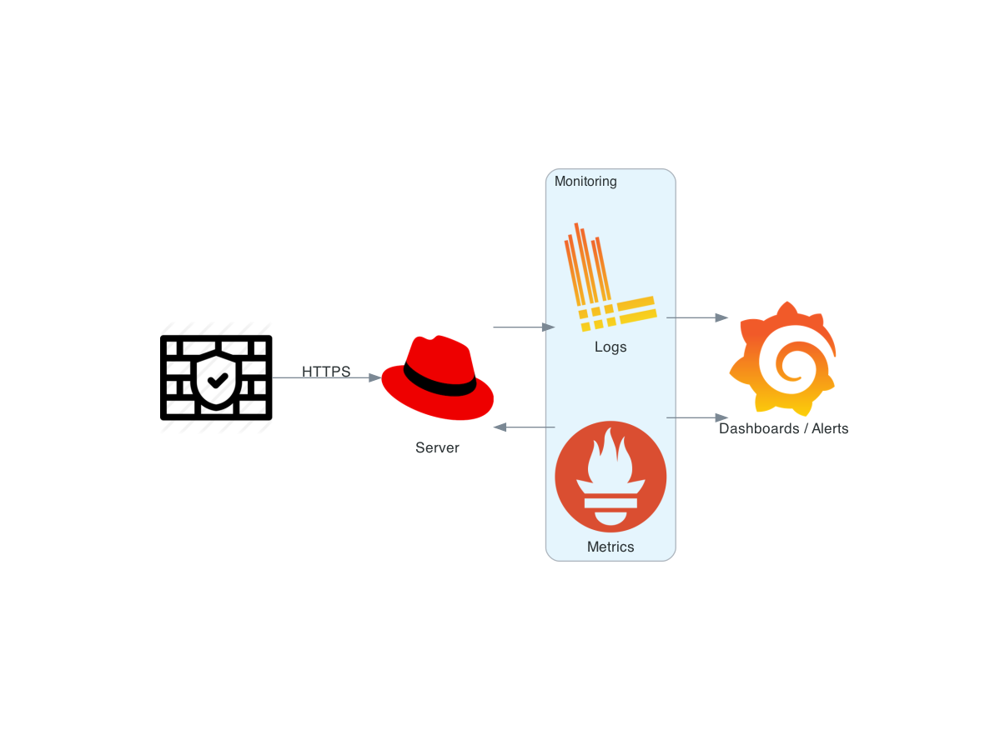

# Scenario 1

## 1 - Requirements

If you don't have Rust installed, you need to download it from https://rustup.rs/ using the following command:

```shell
curl --proto '=https' --tlsv1.2 -sSf https://sh.rustup.rs | sh
```

## 2 - Run
### To compile and run the code, use `cargo run`:

```shell
cargo run
```

Alternatively, you can compile and then run the code in a separate step:

```shell
cargo build

./target/debug/challenge20230611
```

## 3 - Other options

By default, the application will output one number per line, but you can use the option `--same` to display all numbers in the same line with no `\n` line ending.

```shell
cargo run -- --same

# or

./target/debug/challenge20230611 --same
```

Also, it's possible to change the range's `start` and `stop` to be iterated and use a random `seed` number for better reproducibility.

```shell
cargo run -- --start 5 --stop 15 --seed 42

# or

./target/debug/challenge20230611 --start 5 --stop 15 --seed 42
```

Use `--help` to understand each option.


```shell
cargo run -- --help

# or

./target/debug/challenge20230611 --help
```


# Scenario 2

## 1 - A few more questions are good for providing better metrics

 - Which OS (Windows, RHEL Linux, Ubuntu) and proxy software ([HAProxy](https://www.haproxy.org/), [Nginx](https://nginx.org/en/), [Caddy](https://caddyserver.com/), etc.) will be used? And how?

Different SOs and software have various tools and metrics; some features are provided only on paid versions (e.g., [Nginx Plus](https://www.nginx.com/products/nginx/)). Also, we need slightly different monitoring approaches on various Linux distros when deploying DEB/RPM packages with Systemd services or Docker/Podman/K8S images. In this document, I assume Nginx runs as a Systemd service on RHEL.

 - Will the server only do SSL offloading + proxy, or must it cache the results?

In that case, the disks IO and reliability need to be monitored. I'm assuming a cache will be used (due to the disk sizes).

 - Does a WAF(Web Application Firewall) need to be integrated, or does a different appliance provide this?

We must also monitor the WAF and ensure its alerts can be fine-tuned to avoid false positives. I'm assuming no WAF will be deployed on this server.

 - Are there any restrictions for monitoring software or licenses?

I'd stick to the monitoring stack used by the company, such as [Monit](https://mmonit.com/monit/), [Prometheus](https://prometheus.io/), [Zabbix](https://www.zabbix.com/), [Grafana](https://grafana.com/), etc. Also, it's good to note if specific licenses are forbidden in the company ([example](https://opensource.google/documentation/reference/using/agpl-policy)). I assume we can use Prometheus and Grafana.

---

The following diagram exemplifies the connection scheme between the server and monitoring services.



The following metrics are important to implement the SLIs exemplified in [the SRE books](https://sre.google/books/), and depending on the services accessed through the server, some metrics are more valuable than others.


---

## 2 - OS monitoring

 - CPU utilization > 80%
 - Free RAM/Swap
 - Clock drift and NTP sync
 - Used disk space, inodes, and IOPs
 - NIC bandwidth utilization and errors
 - Linux syslog messages
 - Linux and application uptime

I'd use [Prometheus](https://prometheus.io/) to scrape a [node_exporter](https://github.com/prometheus/node_exporter) and `Promtail` agent to send logs (Syslog, Nginx, etc.) to [Grafana Loki](https://grafana.com/oss/loki/). I'd also monitor the logs to check user access and S.M.A.R.T. information about errors on the disks. It's essential to set a firewalld/iptables rule to allow only requests from the Prometheus server to the exporter port.

## 3 - Application monitoring
 - Nginx access/error log
 - successful/failed/reused SSL handshakes
 - SSL certificate expiration date < 30 days
 - active/drop connections by upstream server
 - response time
 - response latency
 - response codes (200, 40x, 50x)
 - heartbeat of services

We can use [Nginx exporter](https://github.com/nginxinc/nginx-prometheus-exporter) and Prometheus for the metrics and [Grafana Loki](https://grafana.com/oss/loki/) for the logs.

Note: some of those metrics are available only on Nginx Plus.

## 4 - Challenges

The main challenge is the amount of resources (disk, network, etc.) used to collect all those logs and metrics due to the number of connections per second. I'd check with the product owner and development team to understand better what SLOs and SLIs are needed for all services accessible through this server. Also, I'd check every postmortem analysis available of failures of those services to choose which ones are more important to the monitor. I'd use some PDCA cycles to fine-tune the metric frequency, retention, and purge (or add) other metrics.
